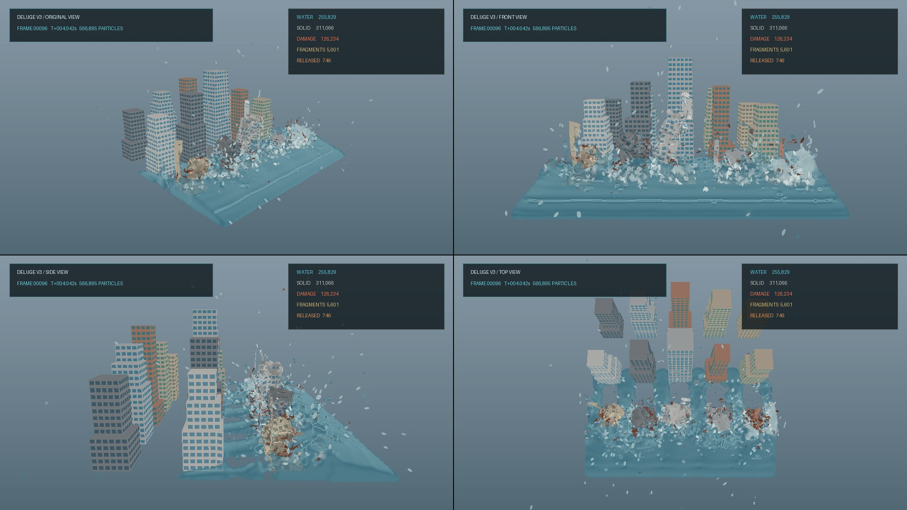

# DELUGE V3 — GPU Tsunami and City Destruction Simulator

DELUGE V3 is an offline CUDA simulation of a large tsunami hitting a destructible modern city. It combines adaptive 3D SPH water, a GPU shallow-water far field, structural fracture, rigid debris, a reconstructed water surface, and four synchronized camera views.



The project targets an NVIDIA RTX 5070 with 12 GB of VRAM. It prioritizes physical state, reproducibility, and high-quality offline output over real-time playback.

## Main features

- CUDA simulation through NVIDIA Warp.
- Adaptive water particles at 1.0, 0.5, 0.325, and 0.1625 m scales.
- A conservative 2D shallow-water far field with bidirectional transfer to the local 3D SPH region.
- GPU free-surface classification, anisotropic surface samples, foam, and Marching Cubes reconstruction.
- Temporally stable mesh bounds and voxel LOD with local high-resolution splash bricks.
- Fifteen physically different building silhouettes: rectangular, podium, setback, tapered, and offset towers.
- Six coordinated facade palettes for concrete, stone, brick, glass, and roofs.
- Explicit slabs, walls, beams, columns, cores, glazing, floor spans, and roofs.
- Dormant structural LOD: untouched buildings remain inexpensive fixed water boundaries.
- Local structural refinement near predicted impact and growing cracks.
- Cohesive architectural fragments that prevent buildings from dissolving into particle dust.
- Structural-role fracture hierarchy: glazing yields first, while slabs, beams, columns, and cores progressively resist more strain and accumulate damage more slowly.
- Rigid-cluster conversion for detached, settled debris.
- Frictional rigid-debris contacts with equal-and-opposite forces and torques.
- Rigid-to-deformable reactivation after a new strong collision.
- Original, front, side, and top cameras combined into one 1920×1080 video.
- Direct NVENC output without intermediate PNG sequences.
- A playable MP4 is atomically updated after every completed simulated second.
- Checkpoint and resume support for both particle and V3 hybrid state.

## Requirements

- Windows 10 or 11
- NVIDIA GPU with CUDA support
- A current NVIDIA driver
- Python 3.11 or newer
- FFmpeg/ffprobe available on `PATH` for validation and video inspection

The launcher creates `.venv` automatically and installs the Python packages from `requirements.txt`.

## Run

Double-click:

```bat
start_v3_rtx5070.bat
```

Or run from a terminal:

```bat
.venv\Scripts\python.exe deluge_v3.py --config config_v3_rtx5070.json
```

Useful short runs:

```bat
.venv\Scripts\python.exe deluge_v3.py --config config_v3_rtx5070.json --frames 100
.venv\Scripts\python.exe deluge_v3.py --config config_v3_rtx5070.json --duration 0.25
```

Do not run production V2 and V3 simulations simultaneously. They will compete for the same GPU and invalidate timing measurements.

## Progressive video output

The default configuration writes four views into one `deluge_v3.mp4`. No PNG frame sequence is created.

Frames are encoded in completed one-second segments. After each simulated second, all finished segments are stream-copied into a new preview and atomically replace the public MP4. This has three useful properties:

- the MP4 becomes non-zero and playable after the first 24 frames at 24 FPS;
- readers never observe a half-written replacement file;
- if the solver is interrupted, the last public MP4 and completed files in the `.segments` directory remain recoverable.

Reopen the file in VLC or mpv after another simulated second is completed to see the latest version. On normal completion, the temporary segment directory is removed.

## Current RTX 5070 results

The V3.10 100-frame production run used four cameras in one H.264 video:

- 100 output frames, 4.1667 simulated seconds;
- 591.1 seconds total wall time before the V3.11 query optimization;
- 5.84 seconds average and 18.11 seconds maximum per output frame;
- 170,131 initial particles and 598,436 peak particles after adaptive refinement;
- 276,342 peak fluid particles and 322,094 peak structural particles;
- 1,932 MiB peak reported VRAM use;
- 343 released architectural fragments;
- 40,582-44,435 late water-mesh vertices after frame 85;
- a constant 0.65 m water voxel from frame 0 through frame 99;
- zero water-mesh LOD changes and no late collapse to spherical spray;
- 21,952 m3 emitted from shallow water and 7,914 m3 returned from SPH;
- -0.070% combined 2D+3D water-volume drift over 4.1667 simulated seconds;
- 27.69 m maximum water height and zero water particles above 30 m.

V3.11 reduces the physically complete neighbour radius from 1.8 to 1.55 structural spacings. The longest possible bond is 3.2 times a 0.48-spacing particle radius, or 1.536 spacings, so no valid bond is clipped. On checkpoint 96 this reduced a substep from 49.30 to 40.65 ms (17.5%). Real four-view frames 98-100 fell from 17.70 to 14.67 seconds on average (17.1%) while retaining 343 released fragments and changing final damaged-particle count by only 0.06%.

The V3.4 wide-scene validation used a 420 m domain and 45 buildings:

- 508,747 initial particles;
- 19,320 shallow-water cells;
- about 1.64 GiB reported VRAM use.

The shallow-water regression measured 0.249% volume drift after one simulated second. Both the SPH↔2D exchange impulse and the shallow-to-SPH emission volume/momentum tests have zero float32 residual.

## Water representation

The local impact region is simulated with 3D SPH particles. Only classified free-surface particles contribute to rendering. A compact GPU scalar field is smoothed and reconstructed with Warp Marching Cubes.

Sparse distant droplets do not expand the global reconstruction box. Bounds expand immediately but shrink gradually; improved voxel LOD requires eight stable frames. Dense splash sheets outside the main water body receive up to six local 12 m mesh bricks with a 0.4 m voxel, while isolated droplets stay inexpensive anisotropic spray samples.

The shallow-water far field and the local SPH surface are now reconstructed as one mesh. Graphical samples from the 2D field are smoothly blended to the robust SPH free-surface height in the overlap, then splatted into the same scalar field before Marching Cubes. There is no second water plane at another height.

Empty interface sites can emit SPH particles from the shallow field. Every emitted particle removes the same volume and horizontal momentum from its source 2D cell in the same rendered frame, including checkpoint boundaries.

Return flow is symmetric. SPH particles crossing back through the overlap give their exact volume and horizontal momentum to the shallow field. A GPU prefix scan then compacts every particle-aligned array, including fracture, rigid-body, multirate, and facade-anchor indices. The return-flow regression has zero volume and momentum residual.

## Structural model

Buildings begin as inexpensive fixed SPH boundaries. A building activates only after a coherent hydrodynamic load reaches enough facade samples. Foundations remain anchored.

Each building contains physically sampled floor slabs, roofs, walls, beams, columns, cores, and glass. Structural particles are grouped into cohesive architectural fragments approximately 4.5×3×4.5 m. Joints between fragments can fail, but the fragment interior remains connected, so failure produces apartment-scale slabs and wall sections instead of independent particle dust.

Failure strain and damage rate depend on structural role. Glass is deliberately fragile, ordinary walls are the baseline, and resistance increases through slabs, beams, columns, and reinforced cores. Metrics are volume-weighted so adaptive 1-to-4 refinement cannot fake an increase in damaged structure merely by creating more samples.

Detached calm fragments can become rigid clusters. Their mass, center of mass, inertia tensor, linear momentum, and angular momentum are fitted in double precision. Rigid motion and contacts then run on CUDA. Concrete, glass, and reinforcement use different contact stiffness and friction. A sufficiently strong later collision reactivates the cohesive deformable model.

## Validation

Run the complete CUDA regression batch:

```bat
validation\validate_v3_gpu.bat
```

Validate a completed 100-frame production directory:

```bat
.venv\Scripts\python.exe validation\validate_production_output.py outputs\your_run --expected-frames 100
```

It covers:

- adaptive refinement and conservation of mass, volume, momentum, and center of mass;
- rigid fitting, motion, contact force/torque balance, friction, and reactivation;
- multirate momentum and city-state agreement;
- architectural fragment scale and the glass-to-core fracture hierarchy;
- shallow-water volume and conservative overlap impulse;
- conservative shallow-to-SPH emission and SPH-to-shallow return-flow compaction;
- free-surface classification and reconstructed top-layer closure;
- robust late mesh bounds, temporal hysteresis, and splash-brick selection;
- physical building-style diversity and facade palettes;
- early opening and finalization of progressive NVENC MP4 output.

## Important files

- `deluge_v3.py` — V3 orchestration, checkpoints, surface reconstruction, and simulation loop integration.
- `solver_base.py` — shared particle solver and output loop in the standalone repository.
- `shallow_water.py` — GPU shallow-water solver and conservative SPH interface coupling.
- `validation\validate_production_output.py` — MP4, water-balance, late-mesh, and metric validation.
- `assemble_resumed_run.py` — lossless MP4 and metric assembly for checkpoint-resumed runs.
- `validation\validate_shallow_return.py` — end-to-end return-flow, compaction, and facade-anchor validation.
- `validation\validate_fragment_scale.py` — apartment-scale anti-dust fragment validation.
- `validation\validate_structural_hierarchy.py` — CUDA fracture-resistance hierarchy validation.
- `profile_v3_kernels.py` — per-kernel CUDA timing at a fresh scene or checkpoint.
- `hybrid_kernels.py` — structural LOD, fracture, multirate, rigid-body, contact, and facade CUDA kernels.
- `hybrid_model.py` — cohesive fragments, refinement axes, and facade generation.
- `hybrid_renderer.py` — facade and reconstructed-water rendering.
- `surface_kernels.py` — free-surface classification, sparse fields, temporal blending, and water rasterization.
- `config_v3_rtx5070.json` — production RTX 5070 configuration.
- `ROADMAP.md` — development stages and acceptance criteria.

## Status

V3.3d mesh stability, V3.4 shallow-water far field, V3.5 debris contacts, V3.6 progressive output, the 100-frame V3.7 stitched-water run, and V3.8 bidirectional water transfer are implemented and validated. The duplicated far-water plane is removed, shallow and SPH samples feed one reconstructed surface, and a playable MP4 is exposed every completed simulated second.

At checkpoint 96, real return flow merged 618 particles / 593.5 m3 over three frames while preserving facade bindings. The contour audit measured only 32.9 ms for the complete water-mesh build versus seconds for a late output frame, so tiled Marching Cubes remains lower priority. A separate solid-only grid was tested and rejected because its extra indirection made the substep slower. The physically complete 1.55-spacing query radius was retained after CUDA regressions and a resumed production comparison showed a 17.1% frame-time improvement.

The complete eight-second validation now passes. The assembled four-view H.264 video contains 192 frames at 1920x1080 and 24 fps. The water reconstruction remained at a 0.65 m voxel for every frame, used at most 5,121,225 field nodes, and retained 34,956-42,873 late mesh vertices. Peak load was 928,147 particles and 1,995.6 MiB VRAM; combined shallow/SPH water-volume drift was -0.750%. The main field limit is 6 million nodes, while detached water above 42 m is routed to local splash bricks so high spray cannot coarsen the complete connected surface.

The next milestone is structural fracture calibration: preserve larger slabs, wall panels, floor spans, and reinforced cores instead of producing excessive fine debris during the first impact.

## V3.9 impact-energy and activation guards

The first V3.8 full-run review found a non-physical WCSPH tail: checkpoint 144 contained water moving vertically at up to 129.6 m/s, with particles reaching the 90 m domain ceiling. The configured 14 m depth, 6 m crest, and 19 m/s incoming flow provide an ideal total energy head equivalent to only about 27.4 m/s. V3.9 therefore limits water to 30 m/s total and 18 m/s vertically; the ordinary incoming flow remains untouched.

Building activation now requires at least 12 lower-facade samples (rest elevation at most 8 m) to carry a +Z load above 5 m/s2 for 0.02 continuous seconds. Exposure decays four times faster when the load disappears. High, lateral, reverse, or momentary splash impacts no longer unlock the complete deformable building graph.

In the clean 60-frame / 2.5-second impact validation, the first row activated at 0.875 s, with zero active buildings and zero damage beforehand. The second and third rows remained dormant. Peak water height was 22.01 m; the final 99th and 99.9th percentiles were 15.36 m and 17.03 m, and no water particle exceeded 30 m. `validation\validate_impact_gates.py` covers the CUDA speed and sustained-load gates.

## V3.10 architectural fracture and volume diagnostics

The coarse city now contains 2,991 apartment-scale cohesive fragments with a median of 20 coarse samples. Minimum fragment and release thresholds were raised, intra-fragment stiffness was increased, and fracture propagation was slowed. In the clean 60-frame impact test, released fragments fell from 357 in V3.9 to 115, a 67.8% reduction.

Diagnostics report damaged physical volume and volume-integrated damage per structural role, in addition to legacy particle counts. At 2.5 seconds, damage began one frame after causal activation; columns had 2.08% damaged volume and cores 2.57%, while more exposed walls, beams, and glass reached 3.17%, 4.50%, and 4.44%. Adaptive refinement therefore no longer corrupts the comparison by multiplying sample counts.

## V3.14-V3.17 causal collapse, adaptive water, and debris skins

V3.14 propagates gravity release through a sparse fragment support graph. Upper floors and walls fall when their load path to a foundation is actually broken; the solver no longer relies on a delayed whole-building collapse patch. V3.15 adds material-specific local impact impulse. A sufficiently massive splash can break glass locally, while complete building activation still requires a sustained coherent lower-facade water load.

V3.16 refines only free-surface or strongly vertical/turbulent SPH samples. Every 1-to-8 split records a sibling ID. A complete octet may merge back only below the surface band when its vertical speed, internal velocity RMS, and spatial span are all small. The replacement preserves total mass, volume, center of mass, and linear momentum. In the 100-frame RTX 5070 validation, 1,855 calm octets merged back, removing 12,985 fine samples without changing the fixed 0.65 m water-mesh voxel.

V3.17 adds six-face render hulls for all 3,060 apartment-scale cohesive fragments. The 18,360 extra faces are culled before rasterization while their fragment has a live foundation path. When support is lost, the closed hull becomes visible with the original building palette, so detached concrete, slabs, and frame pieces remain large volumetric debris instead of reverting to particle circles.

The V3.17 100-frame four-view run completed in 269.75 seconds on an RTX 5070. It peaked at 409,831 particles, 1,963.6 MiB VRAM, 251 released fragments, 36 unsupported fragments, and 19 rigid clusters. The connected water mesh stayed at 0.65 m and reached 56,868 vertices; combined shallow/SPH water-volume drift was -0.813%.

## Next stages

1. Add explicit crack-surface energy and visible crack decals before a complete fragment boundary separates.
2. Replace axis-aligned debris hulls with cached fragment convex hulls or low-resolution tetrahedral boundary skins.
3. Separate connected water, thin sheets, entrained foam, and ballistic droplets; give droplets a lifetime and merge them back into the connected surface on contact.
4. Move conservative sibling-group selection fully onto CUDA. The current CPU audit runs only every eight output frames and is already small, but a sorted GPU group table will scale better beyond one million active SPH samples.
5. Run the complete eight-second V3.17 sequence and audit late debris contacts, water balance, surface LOD, and progressive-video recovery.
